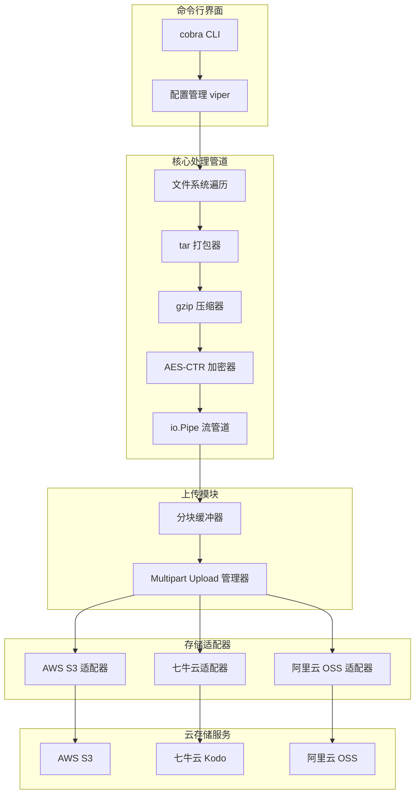
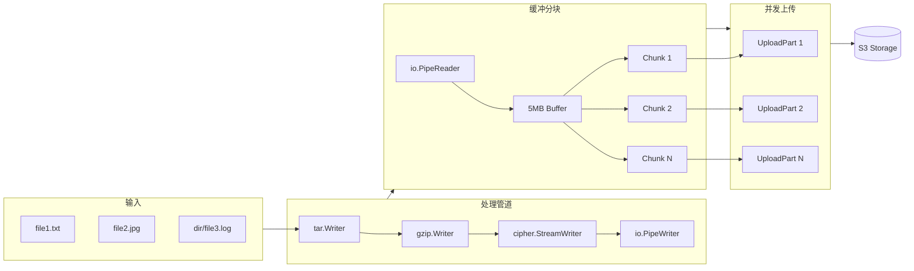

# S3Backup - 流式备份工具架构设计

## 项目概述

S3Backup 是一个 Go 语言编写的命令行备份工具，支持边打包边上传到 S3 兼容存储，并能适配各云存储服务的独特功能（如存储类型设置）。

### 核心特性

- **流式处理**：边打包压缩边上传，无需本地临时文件，内存占用低
- **加密支持**：AES-256-CTR + HMAC-SHA512 流式加密
- **多云适配**：支持 AWS S3、七牛云 Kodo、阿里云 OSS 等 S3 兼容存储
- **存储类型**：支持设置低频存储、归档存储等低成本存储类型
- **断点续传**：基于 S3 Multipart Upload 实现大文件可靠上传

---

## 系统架构



---

## 数据流设计

### 流式处理管道



### 关键设计点

1. **io.Pipe 连接**：使用 `io.Pipe()` 将压缩/加密的写入端与上传的读取端连接
2. **固定缓冲区**：使用 5MB 固定缓冲区读取数据，满足 S3 Multipart Upload 最小分块要求
3. **并发上传**：可配置并发数，同时上传多个分块提高效率
4. **内存控制**：整个过程内存占用约为 `并发数 × 5MB`

---

## 模块设计

### 1. 配置模块 `pkg/config`

```go
type Config struct {
    // 存储配置
    Storage StorageConfig `yaml:"storage"`
    // 加密配置
    Encryption EncryptionConfig `yaml:"encryption"`
    // 备份配置
    Backup BackupConfig `yaml:"backup"`
}

type StorageConfig struct {
    Provider     string `yaml:"provider"`     // aws, qiniu, aliyun
    Endpoint     string `yaml:"endpoint"`
    Region       string `yaml:"region"`
    Bucket       string `yaml:"bucket"`
    AccessKey    string `yaml:"access_key"`
    SecretKey    string `yaml:"secret_key"`
    StorageClass string `yaml:"storage_class"` // 存储类型
}

type EncryptionConfig struct {
    Enabled    bool   `yaml:"enabled"`
    Password   string `yaml:"password"`    // 用于派生密钥
    KeyFile    string `yaml:"key_file"`    // 或直接使用密钥文件
}

type BackupConfig struct {
    Includes    []string `yaml:"includes"`     // 包含路径
    Excludes    []string `yaml:"excludes"`     // 排除模式
    Compression string   `yaml:"compression"`  // gzip, none
    ChunkSize   int64    `yaml:"chunk_size"`   // 分块大小，默认 5MB
    Concurrency int      `yaml:"concurrency"`  // 并发上传数
}
```

### 2. 存储适配器接口 `pkg/storage`

```go
// StorageAdapter 定义存储适配器接口
type StorageAdapter interface {
    // 初始化 Multipart Upload
    InitMultipartUpload(ctx context.Context, key string, opts UploadOptions) (uploadID string, err error)
    
    // 上传分块
    UploadPart(ctx context.Context, key, uploadID string, partNum int, data io.Reader, size int64) (etag string, err error)
    
    // 完成上传
    CompleteMultipartUpload(ctx context.Context, key, uploadID string, parts []CompletedPart) error
    
    // 取消上传
    AbortMultipartUpload(ctx context.Context, key, uploadID string) error
    
    // 获取支持的存储类型
    SupportedStorageClasses() []StorageClass
    
    // 设置存储类型（部分服务需要上传后修改）
    SetStorageClass(ctx context.Context, key string, class StorageClass) error
}

// UploadOptions 上传选项
type UploadOptions struct {
    StorageClass StorageClass
    ContentType  string
    Metadata     map[string]string
}

// StorageClass 存储类型
type StorageClass string

const (
    StorageClassStandard       StorageClass = "STANDARD"
    StorageClassInfrequent     StorageClass = "INFREQUENT_ACCESS"
    StorageClassArchive        StorageClass = "ARCHIVE"
    StorageClassDeepArchive    StorageClass = "DEEP_ARCHIVE"
)
```

### 3. 各云存储类型映射

| 通用类型 | AWS S3 | 七牛云 Kodo | 阿里云 OSS |
|---------|--------|------------|-----------|
| STANDARD | STANDARD | 0 (标准) | Standard |
| INFREQUENT_ACCESS | STANDARD_IA | 1 (低频) | IA |
| ARCHIVE | GLACIER | 2 (归档) | Archive |
| DEEP_ARCHIVE | DEEP_ARCHIVE | 3 (深度归档) | ColdArchive |

### 4. 加密模块 `pkg/crypto`

```go
// 使用 AES-256-CTR + HMAC-SHA512 进行流式加密
// 文件格式：
// [16 bytes IV][encrypted data...][64 bytes HMAC]

type StreamEncryptor struct {
    key    []byte           // 32 bytes AES-256 key
    hmacKey []byte          // 64 bytes HMAC key
}

func (e *StreamEncryptor) WrapWriter(w io.Writer) (io.WriteCloser, error)
func (e *StreamEncryptor) WrapReader(r io.Reader) (io.Reader, error)

// 密钥派生：使用 Argon2id 从密码派生密钥
func DeriveKey(password string, salt []byte) (aesKey, hmacKey []byte)
```

### 5. 打包模块 `pkg/archive`

```go
type Archiver struct {
    includes []string
    excludes []glob.Glob
}

// Archive 将文件打包为 tar.gz 流
func (a *Archiver) Archive(ctx context.Context, w io.Writer) error

// 内部实现：
// 1. 创建 gzip.Writer 包装 w
// 2. 创建 tar.Writer 包装 gzip.Writer
// 3. 遍历 includes 中的路径
// 4. 对每个文件写入 tar header 和内容
// 5. 支持 context 取消
```

### 6. 上传管理器 `pkg/uploader`

```go
type Uploader struct {
    adapter     storage.StorageAdapter
    chunkSize   int64
    concurrency int
}

// Upload 从 reader 读取数据并上传
func (u *Uploader) Upload(ctx context.Context, key string, r io.Reader, opts UploadOptions) error

// 内部实现：
// 1. 调用 InitMultipartUpload
// 2. 启动 worker goroutines
// 3. 循环读取 chunkSize 数据到缓冲区
// 4. 将缓冲区发送给 worker 上传
// 5. 收集所有 part 的 ETag
// 6. 调用 CompleteMultipartUpload
// 7. 错误时调用 AbortMultipartUpload
```

---

## CLI 命令设计

```bash
# 基本用法
s3backup backup [flags] <paths...>

# 示例
s3backup backup \
  --config ~/.s3backup.yaml \
  --storage-class archive \
  --encrypt \
  --password "secret" \
  /path/to/backup

# 可用命令
s3backup backup      # 执行备份
s3backup restore     # 恢复备份（后续实现）
s3backup list        # 列出备份（后续实现）
s3backup config      # 配置管理

# 全局 Flags
--config, -c         # 配置文件路径
--provider, -p       # 存储提供商 (aws/qiniu/aliyun)
--bucket, -b         # 存储桶名称
--endpoint           # 自定义端点
--access-key         # Access Key
--secret-key         # Secret Key

# backup 命令 Flags
--storage-class, -s  # 存储类型 (standard/ia/archive/deep_archive)
--encrypt, -e        # 启用加密
--password           # 加密密码
--key-file           # 密钥文件
--exclude            # 排除模式（可多次指定）
--name, -n           # 备份文件名（默认：backup-{timestamp}.tar.gz.enc）
--concurrency        # 并发上传数（默认：4）
--chunk-size         # 分块大小（默认：5MB）
--dry-run            # 模拟运行，不实际上传
```

---

## 配置文件示例

### 主配置文件 `~/.s3backup.yaml`

```yaml
# ~/.s3backup.yaml

# 存储配置
storage:
  provider: qiniu
  endpoint: s3.cn-east-1.qiniucs.com
  region: cn-east-1
  bucket: my-backup-bucket
  # 敏感信息从 .env 文件或环境变量读取
  # access_key: ${S3BACKUP_ACCESS_KEY}
  # secret_key: ${S3BACKUP_SECRET_KEY}
  storage_class: archive  # 默认存储类型

# 加密配置
encryption:
  enabled: true
  # password: 从命令行、.env 文件或环境变量获取
  # key_file: /path/to/keyfile

# 备份配置
backup:
  excludes:
    - "*.log"
    - "*.tmp"
    - ".git/**"
    - "node_modules/**"
  compression: gzip
  chunk_size: 5242880  # 5MB
  concurrency: 4
```

### 环境变量文件 `.s3backup.env`

```bash
# ~/.s3backup.env 或项目目录下的 .s3backup.env
# 敏感信息配置，此文件应添加到 .gitignore

# 存储凭证
S3BACKUP_ACCESS_KEY=your-access-key
S3BACKUP_SECRET_KEY=your-secret-key

# 加密密码（可选，也可通过命令行 --password 指定）
S3BACKUP_ENCRYPT_PASSWORD=your-encryption-password
```

### 配置优先级

配置加载优先级从高到低：

1. **命令行参数**：`--access-key`, `--secret-key`, `--password` 等
2. **环境变量**：`S3BACKUP_ACCESS_KEY`, `S3BACKUP_SECRET_KEY` 等
3. **.env 文件**：`.s3backup.env`
4. **配置文件**：`~/.s3backup.yaml` 或 `--config` 指定的文件
5. **默认值**

### .env 文件查找顺序

1. `--env-file` 参数指定的路径
2. 当前目录下的 `.s3backup.env`
3. 用户主目录下的 `~/.s3backup.env`

---

## 项目目录结构

```
s3backup/
├── cmd/
│   └── s3backup/
│       └── main.go           # 程序入口
├── internal/
│   └── cli/
│       ├── root.go           # 根命令
│       ├── backup.go         # backup 命令
│       ├── config.go         # config 命令
│       └── flags.go          # 通用 flags
├── pkg/
│   ├── config/
│   │   ├── config.go         # 配置结构
│   │   └── loader.go         # 配置加载
│   ├── storage/
│   │   ├── adapter.go        # 适配器接口
│   │   ├── aws.go            # AWS S3 适配器
│   │   ├── qiniu.go          # 七牛云适配器
│   │   ├── aliyun.go         # 阿里云 OSS 适配器
│   │   └── storage_class.go  # 存储类型定义
│   ├── crypto/
│   │   ├── encryptor.go      # 加密器
│   │   ├── key.go            # 密钥派生
│   │   └── stream.go         # 流式加密
│   ├── archive/
│   │   ├── archiver.go       # 打包器
│   │   └── walker.go         # 文件遍历
│   └── uploader/
│       ├── uploader.go       # 上传管理器
│       └── multipart.go      # Multipart 上传
├── go.mod
├── go.sum
├── README.md
├── .s3backup.example.yaml    # 示例配置文件
└── .s3backup.example.env     # 示例环境变量文件
```

---

## 依赖库

| 库 | 用途 |
|---|------|
| `github.com/spf13/cobra` | CLI 框架 |
| `github.com/spf13/viper` | 配置管理 |
| `github.com/joho/godotenv` | .env 文件加载 |
| `github.com/aws/aws-sdk-go-v2` | AWS S3 SDK |
| `github.com/qiniu/go-sdk/v7` | 七牛云 SDK |
| `github.com/aliyun/aliyun-oss-go-sdk` | 阿里云 OSS SDK |
| `golang.org/x/crypto/argon2` | 密钥派生 |
| `github.com/gobwas/glob` | Glob 模式匹配 |

---

## 实现优先级

### Phase 1: MVP（最小可行产品）
1. 核心流式管道（tar.gz + io.Pipe）
2. AWS S3 适配器（基础 Multipart Upload）
3. 基本 CLI（backup 命令）
4. 配置文件支持

### Phase 2: 加密与多云
5. AES-CTR 流式加密
6. 七牛云适配器
7. 阿里云 OSS 适配器
8. 存储类型设置

### Phase 3: 增强功能
9. 断点续传
10. 进度显示
11. restore 命令
12. list 命令

---

## 安全考虑

1. **密钥管理**：
   - 支持从环境变量读取敏感信息
   - 支持密钥文件而非明文密码
   - 使用 Argon2id 进行密钥派生

2. **加密方案**：
   - AES-256-CTR 提供流式加密能力
   - HMAC-SHA512 提供完整性验证
   - 每次备份使用随机 IV

3. **传输安全**：
   - 强制使用 HTTPS 连接
   - 验证服务器证书

---

## 后续扩展

- 增量备份支持
- 备份元数据管理
- 备份验证功能
- Web UI 管理界面
- 定时备份调度
